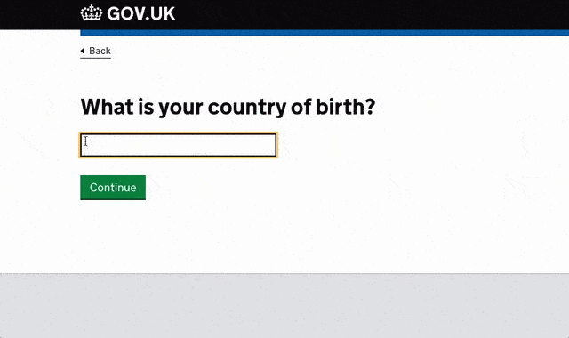

# Country & Territory Autocomplete

## About this component

The GOV.UK country and territory autocomplete is a simple UI widget that allows end users to find and select a location. It includes auto-complete functionality to make it faster and easier for users to find a location. For example, to select their country of birth or their current location. [Further reading on this component can be found here](https://alphagov.github.io/govuk-country-and-territory-autocomplete/).




```scala title="Selenium code"
  driver.findElement(By.id("ID OF ELEMENT")).click()
  driver.findElement(By.id("ID OF ELEMENT")).clear()
  driver.findElement(By.id("ID OF ELEMENT")).sendKeys("United Kingdom")
  driver.findElement(By.id("ID OF ELEMENT")).sendKeys(Keys.TAB)
```
The above code can be used in your UI tests to select a country and/or territory within this component.

:::tip Remember

When writing UI tests for this component, please ensure to obtain the ID for this element and replace it in the above selenium code before use.

:::


## Have feedback for this snippet?
- Reach out to the @testleads within #community-testing
