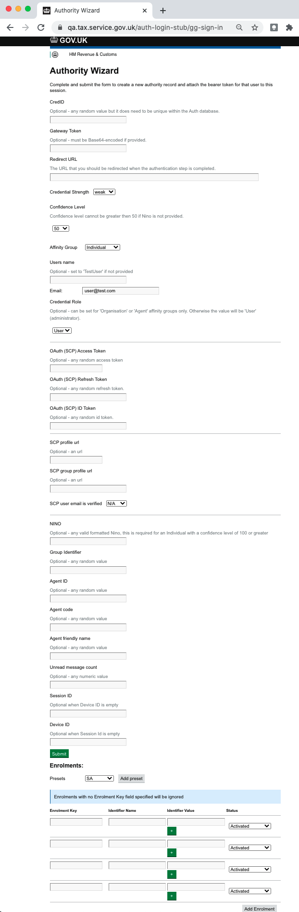

# Auth Login Stub

The [auth login stub page](https://www.qa.tax.service.gov.uk/auth-login-stub/gg-sign-in) is used by teams to create a new authority record and attach the bearer token for that used to a session when writing UI tests.



```scala title="Selenium code"
  driver.findElement(By.id("redirectionUrl")).sendKeys(cocarFrontendUrl)
  new Select(driver.findElement(By.id("credentialStrength"))).selectByValue("strong")
  new Select(driver.findElement(By.id("confidenceLevel"))).selectByValue("200")
  driver.findElement(By.id("nino")).sendKeys(nino)
  driver.findElement(By.id("submit")).click()
```

The docs version dropdown appears in your navbar:


## Update an existing version

It is possible to edit versioned docs in their respective folder:

- `versioned_docs/version-1.0/hello.md` updates `http://localhost:3000/docs/hello`
- `docs/hello.md` updates `http://localhost:3000/docs/next/hello`
